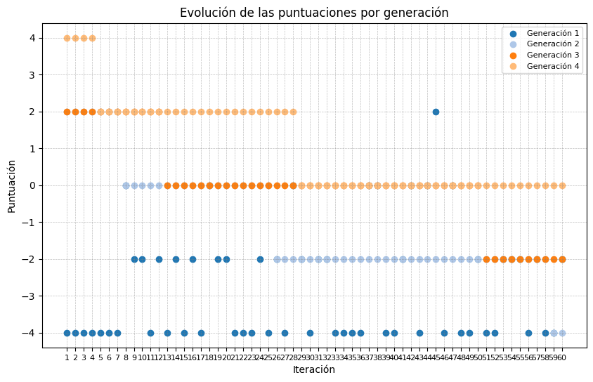

# Algoritmo Genético para resolver Mastermind

## Instalación y Configuración

### Requisitos Previos
- Python ≥ 3.11
- `uv` (gestor de paquetes de Python)

### Instalación

1. Clonar el repositorio:

```bash
git clone https://github.com/MiBasDev/Mastermind-Algoritmos-Geneticos.git
cd mastermind-algoritmos-geneticos
```

2. Crear y activar un entorno virtual con uv:

```bash
python -m pip install uv
uv venv
```

- En Linux/MacOS:

```bash
source .venv/bin/activate
```

- En Windows:

```bash
.venv\Scripts\activate
```

3. Instalar las dependencias:

```bash
uv sync
```

### Dependencias Principales

- **Producción**:
  - `matplotlib >= 3.10.1`

- **Desarrollo**:
  - `ruff ≥ 0.10.0`
  - `pytest >= 8.3.5`

## Uso

Para ejecutar el juego Mastermind:

```bash
uv run main.py
```
O

```bash
python3 main.py
```

## Implementación

El ciclo de vida del algoritmo genético se implementa en la clase **Evolution**, y sigue estas etapas:

1. **Población Inicial** (Método: `initialize_population`)

- Se generan 60 cromosomas aleatorios únicos, donde cada cromosoma es una tupla de 4 colores que representa una posible solución al juego.
- La población inicial es creada aleatoriamente, sin conocimiento del código secreto.

2. **Evaluación** (Método: `fitness_score`)

- Cada cromosoma es evaluado contra el código secreto utilizando la función de **fitness**.
- La función de **fitness** devuelve la diferencia entre los colores correctamente posicionados y los incorrectos:
  - **Clavijas negras**: colores correctos en la posición correcta.
  - **Clavijas blancas**: colores correctos en la posición incorrecta.
- El valor máximo de fitness es 4, lo que significa que el cromosoma ha descubierto el código secreto.

3. **Selección de Padres** (Método: `select_parents`, `weighted_random_choice`)

- Se seleccionan los padres utilizando el método de **"ruleta"** (ruleta de selección proporcional).
- Los cromosomas con mejor **fitness** tienen mayor probabilidad de ser seleccionados como padres para la siguiente generación.
- El tamaño de la población de padres es la mitad de la población total.

4. **Reproducción** (Método: `crossover`)

- Los padres seleccionados se emparejan aleatoriamente.
- Cada pareja genera dos hijos mediante **crossover de punto único** en la posición 2, lo que significa que los primeros dos colores de un padre se combinan con los últimos dos colores del otro padre.
- Los hijos generados se añaden a la población.

5. **Mutación** (Método: `mutate_population`)

- Un porcentaje de la población (definido por `MUTATION_RATE`, en este caso 10%) experimenta mutaciones.
- En cada mutación, un gen (color) aleatorio de un cromosoma es cambiado por otro color diferente al ya presente en ese cromosoma.

6. **Selección de la Nueva Generación** (Método: `select_next_generation`)

- Se implementan dos estrategias para seleccionar la siguiente generación:
  - **Elitismo**: Se seleccionan los 60 mejores cromosomas para la próxima generación.
  - **Selección por ranking**: Se seleccionan cromosomas en función de su **fitness**.

7. **Condición de Parada** (Método: `check_solution`)

El algoritmo se detiene bajo las siguientes condiciones:
- **Código Secreto Descubierto**: Si un cromosoma alcanza un fitness de 4, significa que ha descubierto el código secreto.
- **Número Máximo de Generaciones**: Si el número máximo de generaciones se alcanza sin descubrir el código secreto, el algoritmo se detiene.
- **Máximo Local No Explorados**: Si se detecta que no se está mejorando la solución en varias generaciones, se considera que el algoritmo ha caído en un máximo local.

8. **Graficación del Proceso Evolutivo** (Clase: `Plotter`)

- Al finalizar el ciclo de vida del algoritmo genético, se grafican las puntuaciones de cada generación.
- Los resultados se visualizan usando **matplotlib**, mostrando la evolución del fitness de la población a lo largo de las iteraciones.
- Se pueden observar las fluctuaciones de la población en términos de fitness y ver si el algoritmo converge hacia la solución.

### Detalles Técnicos del Código

1. **Clase Population**:
   - Se encarga de manejar la población de cromosomas.
   - Métodos:
     - `initialize_population`: Inicializa la población con combinaciones aleatorias de colores.
     - `mutate`: Aplica mutaciones a un porcentaje de la población.
     - `select`: Selecciona los mejores cromosomas según el fitness.

2. **Clase Evolution**:
   - Gestiona el ciclo evolutivo completo.
   - Métodos:
     - `fitness_score`: Calcula el fitness de un cromosoma comparando con el código secreto.
     - `select_parents`: Selecciona los padres utilizando el método de ruleta de selección.
     - `crossover`: Realiza el crossover entre padres para generar hijos.
     - `mutate_population`: Aplica mutaciones a la población.
     - `select_next_generation`: Selecciona la nueva generación de cromosomas.
     - `check_solution`: Verifica si algún cromosoma ha alcanzado el código secreto.

3. **Clase Plotter**:
   - Utiliza **matplotlib** para graficar la evolución de las puntuaciones de fitness a lo largo de las generaciones.
   - Proporciona una visualización clara del progreso del algoritmo.

---

### Flujo Completo del Algoritmo:

1. **Inicio**: Se define el código secreto aleatorio.
2. **Generación de la población inicial**: Se crea una población de 60 cromosomas aleatorios.
3. **Evaluación**: Cada cromosoma se evalúa comparándolo con el código secreto.
4. **Selección de Padres**: Se seleccionan padres utilizando el algoritmo de selección por ruleta.
5. **Crossover**: Los padres se emparejan y se realiza el crossover de punto único.
6. **Mutación**: Se aplica la mutación a un porcentaje de la población.
7. **Selección de la nueva generación**: Se seleccionan los mejores cromosomas para la siguiente generación.
8. **Repetir**: Este ciclo continúa hasta que el código secreto es descubierto o se alcanza el número máximo de generaciones.

---

### Resultados

Al final del ciclo, se muestra el código secreto descubierto (si es que lo fue) y se genera un gráfico que visualiza la evolución del fitness a lo largo de las generaciones en una gráfica como esta:



